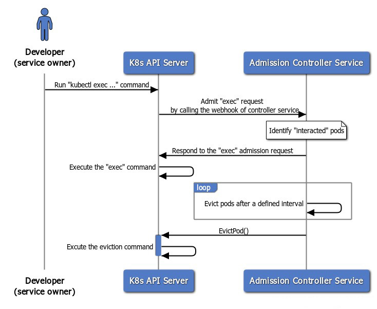

# kube-exec-controller
[](https://opensource.box.com/badges)
[](https://app.travis-ci.com/box/kube-exec-controller)
[](https://goreportcard.com/report/github.com/box/kube-exec-controller)

kube-exec-controller is an [admission controller](https://kubernetes.io/docs/reference/access-authn-authz/extensible-admission-controllers/) for handling container drift (caused by kubectl `exec`, `attach`, `cp`, or other interactive requests) inside a Kubernetes cluster. It runs as a Deployment and can be referred in a `ValidatingWebhookConfiguration` (see the provided [demo/](demo/) as an example) to detect and evict interacted Pods after a pre-defined interval. This project also includes a [kubectl plugin](https://kubernetes.io/docs/tasks/extend-kubectl/kubectl-plugins/), named `kubectl-pi` (*pod-interaction*), for checking such interacted Pods or extending their eviction time.

Here is an overview of running a `kubectl exec` command in a K8s cluster with this admission controller service enabled:



## Install
#### Prerequisite
- [Docker (17.05+)](https://www.docker.com/get-started)
- [Kubernetes (1.16+)](https://kubernetes.io/)
- [Kind (for local development only)](https://kind.sigs.k8s.io/)

If you have a local K8s cluster up running, you can deploy kube-exec-controller and apply its validating admission webhooks simply by:
```
$ git clone git@github.com:box/kube-exec-controller.git
$ cd kube-exec-controller
$ make deploy
```

To see how kube-exec-controller works, let's create a test Pod in your local cluster and send a `kubectl exec` request to it:
```
$ kubectl run test --image=nginx
pod/test created

$ kubectl exec test -- touch new-file
```

You will see the test Pod has some labels attached and receives corresponding K8s events from our controller app:
```
$ kubectl get pod --show-labels
NAME   READY   STATUS    RESTARTS   AGE   LABELS
test   1/1     Running   0          8s    box.com/podInitialInteractionTimestamp=1634408037,box.com/podInteractorUsername=kubernetes-admin,box.com/podTTLDuration=2m0s,run=test

$ kubectl describe pod test
...
Warning  PodInteraction  68s   kube-exec-controller  Pod was interacted with 'kubectl exec/attach' command by a user 'kubernetes-admin' initially at time 2021-10-16 18:04:44.5257517 +0000 UTC m=+27.185038701
Warning  PodInteraction  68s   kube-exec-controller  Pod will be evicted at time 2021-10-16 18:06:44 +0000 UTC (in about 1m59s)
```

You can also utilize the `kubectl pi` plugin to get more detailed info or request an extension to the test Pod's eviction time:
```
$ kubectl pi get
POD_NAME  INTERACTOR        POD_TTL  EXTENSION  EXTENSION_REQUESTER  EVICTION_TIME
test      kubernetes-admin  2m0s                                     2021-10-16 18:06:44 +0000 UTC

$ kubectl pi extend --duration=1m
Successfully extended the termination time of pod/test with a duration=1m

$ kubectl pi get
POD_NAME  INTERACTOR        POD_TTL  EXTENSION  EXTENSION_REQUESTER  EVICTION_TIME
test      kubernetes-admin  2m0s     1m         kubernetes-admin     2021-10-16 18:07:44 +0000 UTC

$ kubectl describe pod test
...
Warning  PodInteraction  29s   kube-exec-controller  Pod eviction time has been extended by '1m', as requested from user 'kubernetes-admin'. New eviction time: 2021-10-16 18:07:44 +0000 UTC
Warning  PodInteraction  29s   kube-exec-controller  Pod will be evicted at time 2021-10-16 18:07:44 +0000 UTC (in about 2m21s)
```

## Usage
#### kube-exec-controller
```
$ kube-exec-controller --help
Usage of /kube-exec-controller:
  -api-server string
    	URL to K8s api-server, required if kube-proxy is not set up
  -cert-path string
    	Path to the PEM-encoded TLS certificate
  -extend-chan-size int
    	Buffer size of the channel for handling Pod extension (default 500)
  -interact-chan-size int
    	Buffer size of the channel for handling Pod interaction (default 500)
  -key-path string
    	Path to the un-encrypted TLS key
  -log-level debug
    	Log level. debug, `info`, `warn`, `error` are currently supported (default "info")
  -namespace-allowlist string
    	Comma separated list of namespaces that allow interaction without evicting their Pods
  -port int
    	Port for the app to listen on (default 8443)
  -ttl-seconds int
    	TTL (time-to-live) of interacted Pods before getting evicted by the controller (default -1)
```

#### kubectl-pi
```
$ kubectl pi --help
Get pod interaction info or request an extension of its termination time

Usage:
  kubectl pi [command] [flags]

Examples:

    # get interaction info of specified pod(s)
    kubectl pi get <pod-name-1> <pod-name-2> <...> -n POD_NAMESPACE

    # get interaction info of all pods under the given namespace
    kubectl pi get -n <pod-namespace> --all

    # extend termination time of interacted pod(s)
    kubectl pi extend -d <duration> <pod-name-1> <pod-name-2> <...> -n POD_NAMESPACE

    # extend termination time of all interacted pods under the given namespace
    kubectl pi extend -d <duration> -n <pod-namespace> --all

Flags:
  -a, --all                            if present, select all pods under specified namespace (and ignore any given pod podName)
      --cluster string                 The name of the kubeconfig cluster to use
      --context string                 The name of the kubeconfig context to use
  -d, --duration string                a relative duration such as 5s, 2m, or 3h, default to 30m (default "30m")
  -h, --help                           help for kubectl
  -n, --namespace string               If present, the namespace scope for this CLI request
  ...
```

## Contribution
Refer to [CONTRIBUTING.md](CONTRIBUTING.md)

## Copyright and License
Copyright 2015 Box, Inc. All rights reserved.

Licensed under the Apache License, Version 2.0 (the "License");
you may not use this file except in compliance with the License.
You may obtain a copy of the License at

   http://www.apache.org/licenses/LICENSE-2.0

Unless required by applicable law or agreed to in writing, software
distributed under the License is distributed on an "AS IS" BASIS,
WITHOUT WARRANTIES OR CONDITIONS OF ANY KIND, either express or implied.
See the License for the specific language governing permissions and
limitations under the License.
